# EchoMerch Architecture

EchoMerch is evolving into a Tmall/Qianniu operations data console. The first stable boundary is read-only: it can inspect historical data, Reqable captures, API contracts, dry-run import plans, and operation guardrails. It does not replay platform requests or execute batch mutations from HTTP routes.

## Target Shape

```mermaid
flowchart LR
  Capture["Reqable / packet samples"] --> Lab["capture_lab"]
  Lab --> Catalog["contracts catalog"]

  Catalog --> Registry["local import run registry"]
  Registry --> Worker["daily import worker"]
  Worker --> Raw["raw response artifacts"]
  Raw --> Staging["staging tables"]
  Staging --> Mart["fact/dim analytics mart"]

  Legacy["legacy_ador read-only DB"] --> Mart
  Mart --> API["FastAPI /api/v1"]
  API --> Auth["session / Bearer auth"]
  Auth --> Web["Vue operations console"]

  Web --> Ops["operations center"]
  Ops --> Preview["preview / validate"]
  Preview --> Execute["confirmed execution"]
  Execute --> Audit["audit logs"]
```

## Implemented Modules

- `modules.analytics`: reads normalized historical reporting data through `legacy_ador`.
- `modules.captures`: summarizes local Reqable capture analysis from `reqable_capture.sqlite3`.
- `modules.contracts`: exposes the API contract catalog generated from Reqable request logs and response candidates.
- `modules.imports`: exposes daily dry-run plans, local preview runs, and date-level crawl task records in SQLite.
- `modules.operations`: exposes batch-operation capability boundaries and required safety flow.
- `modules.access`: owns EchoMerch users, roles, permissions, store scopes, revocable sessions, and access audit records.
- `warehouse`: owns platform/store identity, raw response evidence, canonical shop-day summaries, and endpoint-shaped metrics.
- `workers`: reserved for long-running import and mutation jobs. FastAPI routes must not run crawlers inline.
- `warehouse`: reserved for raw, staging, fact, and dimension data mapping.
- `modules.audit` and `modules.scheduler`: reserved for execution audit and repeatable job control.

## API Boundaries

Current read-only routes:

- `GET /api/v1/analytics/dashboard`
- `GET /api/v1/captures/summary`
- `GET /api/v1/contracts/summary`
- `GET /api/v1/contracts/endpoints`
- `GET /api/v1/imports/daily-dry-run`
- `GET /api/v1/imports/runs`
- `GET /api/v1/imports/runs/{run_id}`
- `GET /api/v1/imports/crawl-runs`
- `GET /api/v1/imports/crawl-runs/{run_id}`
- `GET /api/v1/warehouse/platforms`
- `GET /api/v1/warehouse/stores`
- `GET /api/v1/warehouse/stores/{store_id}/daily-overview`
- `GET /api/v1/warehouse/stores/{store_id}/daily-metrics`
- `GET /api/v1/operations/summary`
- `GET /api/v1/system/capabilities`
- `GET /api/v1/auth/configuration`
- `POST /api/v1/auth/login`
- `GET /api/v1/auth/me`
- `POST /api/v1/auth/logout`
- `GET /api/v1/access/directory`
- `POST /api/v1/access/users`

Local preview route:

- `POST /api/v1/imports/runs/dry-run`

The backfill worker records one `crawl_runs` row per execution and one
`crawl_run_days` row per requested business date. Day states are `ingested`,
`skipped_existing`, `fetch_failed`, and `ingest_failed`. Read connections use
SQLite read-only mode, and only one task of the same type may run for a store at
the same time.

The preview route writes only to the local SQLite registry. Execution routes are intentionally absent. Crawler replay, browser automation, coupon creation, and other platform writes must be implemented as audited workers before any API endpoint can trigger them.

## Access Control

Access control follows a server-authoritative RBAC plus store-scope model:

- A user receives one or more seeded roles; roles resolve to stable permission codes such as `analytics.read` and `imports.manage`.
- A non-super-admin user receives explicit `store_id` scopes. Route dependencies resolve and validate the requested store before the warehouse or legacy adapter runs.
- Browser sessions use an HttpOnly `echomerch_session` cookie with a one-way token hash in `access_sessions`; API clients may use a Bearer token for the same session.
- Login, logout, and account creation write minimal audit events. Tmall/Alimama cookies, CSRF tokens, request signatures, raw JSON, and capture evidence IDs are outside this identity model.
- Vue route guards and navigation filtering improve usability, but they do not replace the FastAPI dependency checks.

Authentication is disabled by default for local development. Set
`ECHO_AUTH_ENABLED=true` and use HTTPS with `ECHO_AUTH_COOKIE_SECURE=true` before
sharing the console. The account page is available at `/access` to users with
`access.manage`.

## Data Layers

Recommended database layers:

- `api_request_observations`: parsed request contracts from Reqable telemetry logs.
- `endpoint_contracts`: host/path/method catalog with date params and response evidence.
- `platforms`: stable platform IDs such as `tmall` and display names such as `天猫`.
- `stores`: platform-scoped store identity, using Chinese physical columns such as `店铺ID`, `平台ID`, `平台主体ID`, and `店铺名称`.
- `store_daily_business_metrics`: Chinese-column daily BI view for the SYCM data overview cards; `签收退款率` maps to `realPayrealRfdRate`, while `sucRefundRate` stays as the separate `成功退款率` metric.
- `store_daily_metric_values_readable`: Chinese-readable metric detail view with original platform metric codes preserved.
- `import_runs`: one row per dry-run or import preview, currently stored in `artifacts/local/echomerch_local.sqlite3`.
- `import_run_items`: endpoint-level candidates for each import run, including target table, status, and mapping notes.
- `crawl_runs` / `crawl_run_days`: task-level and business-date-level progress ledger for the backfill worker.
- `store_daily_overviews`: canonical daily shop metrics used by the dashboard.
- `store_daily_metrics`: long-form endpoint metrics for the store's own `self` scope only. Overview responses store object values directly; trend responses are sliced by `self.statDate` for the requested business day.
- `store_daily_shopping_gold_overviews`: shopping gold daily metrics.
- `store_daily_bybt_overviews`: BYBT daily business overview metrics.
- `store_daily_content_overviews`: content asset and grass-conversion daily metrics.
- `store_daily_taojinbi_overviews`: merged Taojinbi general and detailed daily metrics.
- `staging_*`: endpoint-shaped parser output.
- `fact_*` and `dim_*`: stable analytics tables consumed by dashboard and BI pages.
- `operation_runs`, `operation_items`, `audit_logs`: required before enabling batch platform writes.

The existing `ador_tm` database remains a read-only historical source.

## Frontend Structure

The Vue console now separates daily work surfaces:

- Overview, analytics, products, traffic: normalized business reporting.
- Capture lab: local Reqable sample health.
- Contracts: API catalog and daily endpoint candidates.
- Imports: daily crawl task history, date-level progress, dry-run plans, and guardrails.
- Operations: future batch action center with preview-first safety flow.
- Tasks: capability and automation roadmap.

## Evolution Order

1. Keep enriching the contract catalog from Reqable live MCP and local capture files.
2. Promote stable daily contracts into local import runs with parser previews.
3. Store raw response artifacts and parser output in staging tables.
4. Build fact tables for shop daily, product daily, traffic source, and member analysis.
5. Add scheduler state for repeatable 2-3 day test windows; keep scheduling outside FastAPI request handlers.
6. Add operation templates only after preview, confirmation, idempotency, and audit are implemented.
